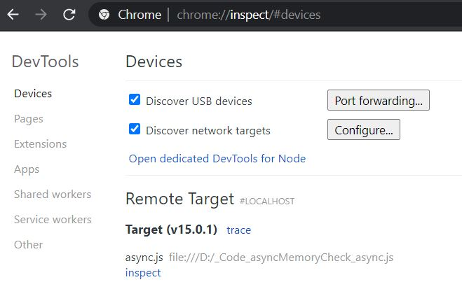
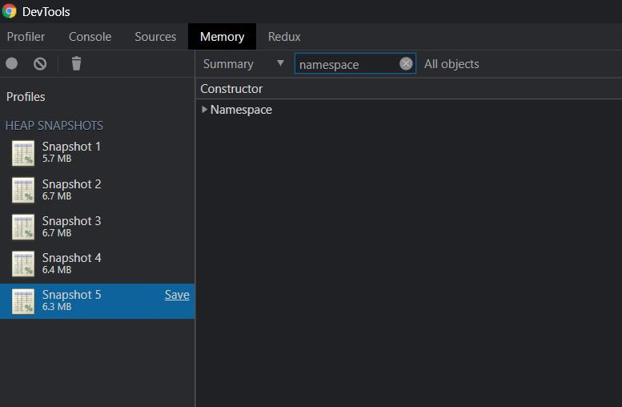
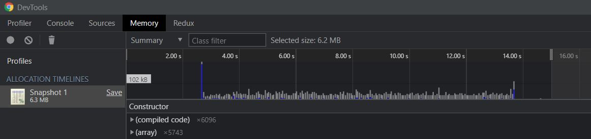
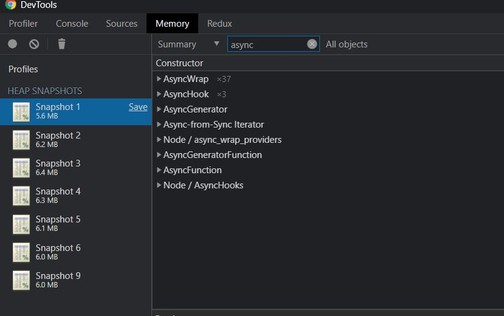
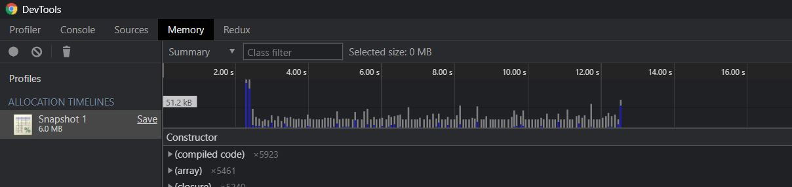

## Memory Utilization of CLS-Hooked & Async-Hook

## Purpose

The repository is a miniature test to see how is memory utilized when using `cls-hooked` and `async-hook` to pass context within `Node.js`.

## Usage

1) `npm run start` for CLS-hooked server **or** `npm run async` for Async-hook server

2) Go to Chrome and paste `chrome://inspect`  

3) Click `inspect` to access to Dev Tools of the server

4) Go to `memory` tab, you may  take snapshot and inspect the `heap` before, during and after bombarding the server with requests

5) `node benchmark.js` to start bombarding server with requests. This is powered by `autocannon`, you may want to increase `connections` or `duration` to see the difference.

## Results

### *CLS-hooked*

| Stat      | 1%    | 2.5%  | 50%   | 97.5% | Avg    | Stdev  | Max   |
| --------- | ----- | ----- | ----- | ----- | ------ | ------ | ----- |
| Req/Sec   | 839   | 839   | 871   | 897   | 870.74 | 14.23  | 839   |
| Bytes/Sec | 237kB | 237kB | 246kB | 253kB | 246kB  | 4.01kB | 237kB |

Req/Bytes counts sampled once per second (Note that this is ran with debugger attached, performance per second would be impacted)

13k requests in 15.05s, 3.68 MB read

### *Async-Hook*

| Stat      | 1%     | 2.5%   | 50%    | 97.5% | Avg    | Stdev  | Max    |
| --------- | ------ | ------ | ------ | ----- | ------ | ------ | ------ |
| Req/Sec   | 300    | 300    | 347    | 400   | 346.4  | 31.35  | 300    |
| Bytes/Sec | 84.6kB | 84.6kB | 97.9kB | 113kB | 97.7kB | 8.84kB | 84.6kB |

Req/Bytes counts sampled once per second (Note that this is ran with debugger attached & plenty of `debug()` messages to show how it `store` is destroyed, performance per second would be impacted)

5k requests in 15.15s, 1.47 MB read

